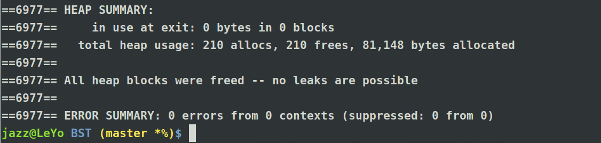
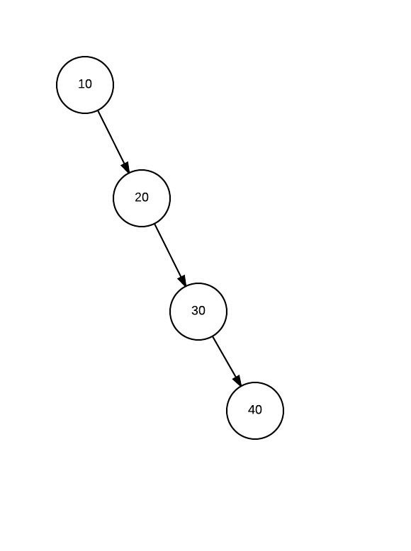
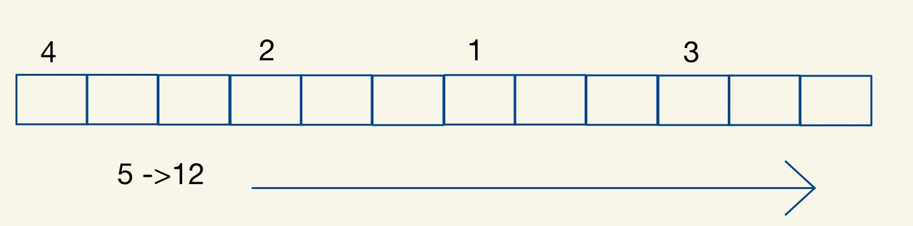
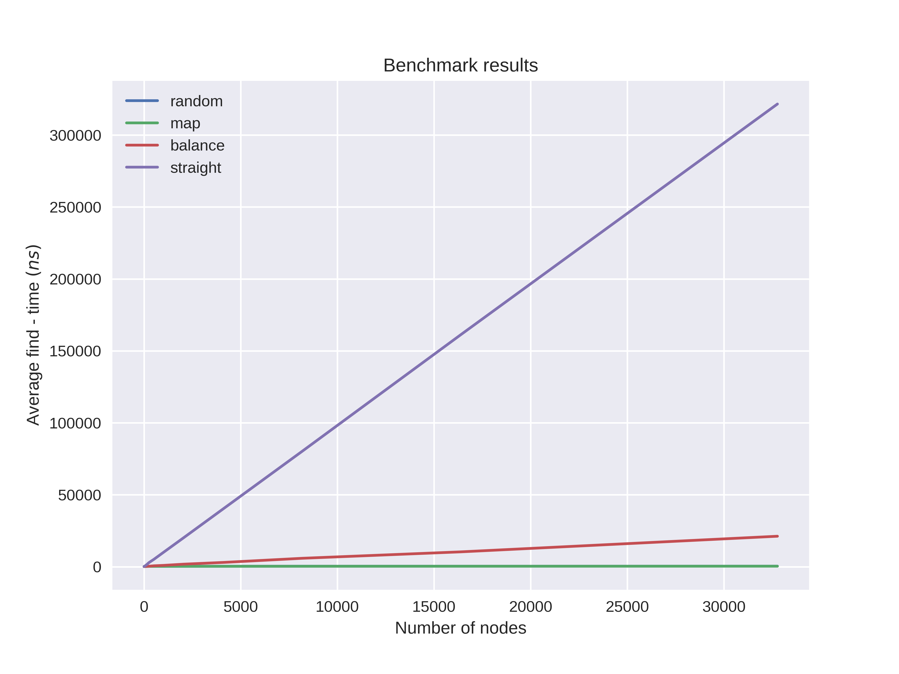
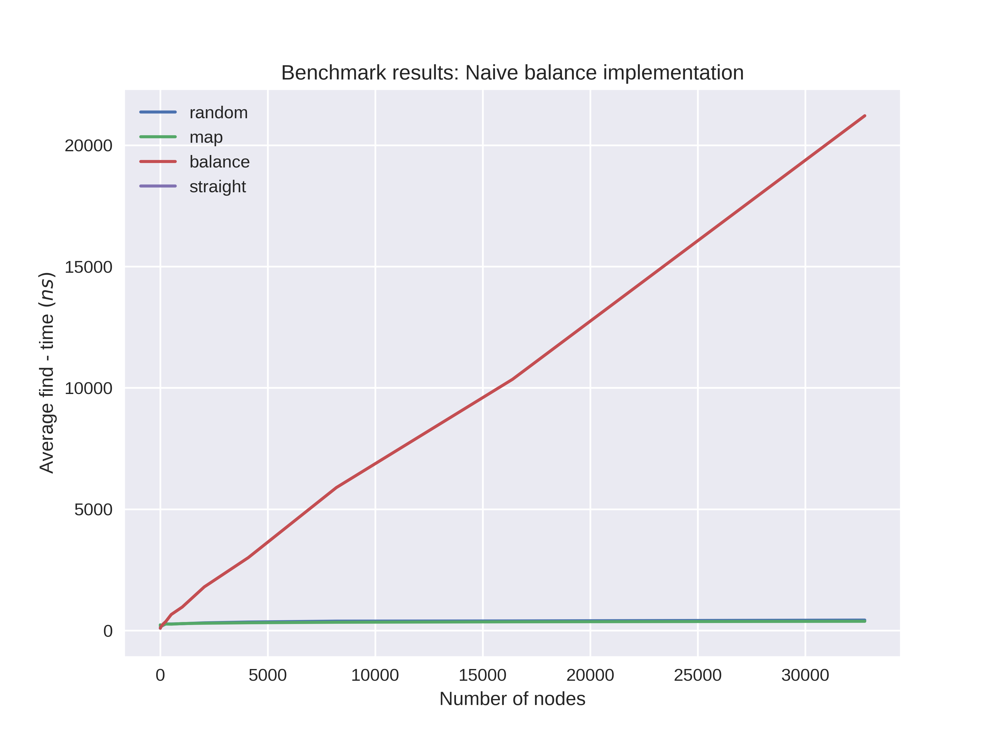
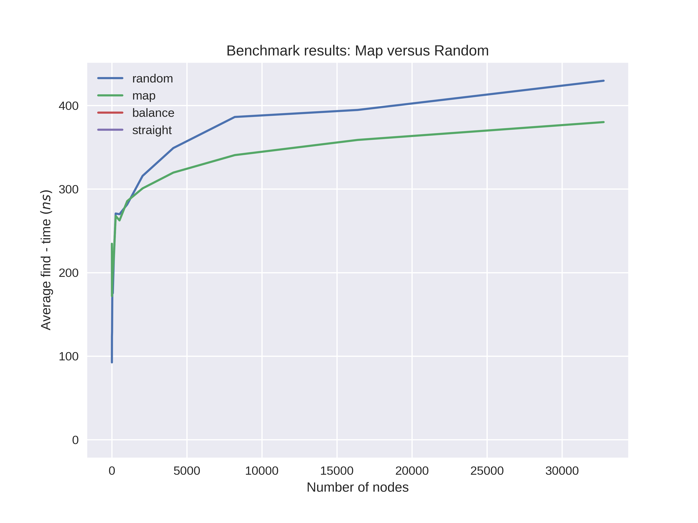

# Advanced Programming Exam Solution - JAZZ


A templated binary search tree can be inspected in this [code](bst.cpp)

## Running the codes

First you have to download the `bst.cpp` and `makefile` then run,

```
make
```

The latest version of the code makes the benchmarking executable.
The benchmark code can be run by providing the number of nodes in which you want to benchmark.
```
./bst.x 10 # number of nodes to be inserted and find
```

A [jobscript](job.sh) is also uploaded to run the benchmarking code for increasing number of nodes.

```
./job.sh
```

## Testing of functions
By commenting out the benchmarking code and uncommenting the testing section of the main function.

We will be able to see the following results.


No memory leaks is observed using the following code and shown by the screenshot.
```
valgrind --leak-check=full --verbose --show-leak-kinds=all ./bst.x 100
```


## Benchmarking
To benchmark the binary search tree, I measured the time it takes for the `find` function of the tree to find a number.
I averaged over all the number that is included in the tree.
This means that my results shows the average find-time of the tree for any number.

Just for sanity checking I first implemented a straight line tree, like the following figure.
Obviously the average find-time of this search tree increases linearly with the number of nodes.


Then I implemented a naive way of balancing the tree.
This can be described by the following pseudocode and figure.

```
1. Get the midpoint
2. Divide the 
3. Insert the remaining nodes.
```


Also I implemented a tree with a random way of inserting the node to the tree for any number of nodes.
We can see later that this way performs better than the naive way that I implemented for large number of nodes `N`.

Lastly, I compared all of the average find-time results to `std::map`.

### Straight Line tree

Shown in this figure is the obvious linear relationship of the find time on a straight line tree.

### Naive balance algorithm

Here I show the performance of my naive way of balancing the tree.
The tree performed poorly compared to the `random` way and `std::map`.

### Random  vs std::map

This is a very interesting result.
This shows that a random way of inserting the nodes, for very large number nodes is somehow efficient, and may perform almost as much as the efficiency of `std::map`.

## Summary
Overall, the main take aways for me in this exam are the concepts of `templates`, c++ `struct` and `class` datatypes, and of course `ITERATORS`, `pointer` handling, and "overloading" (maybe there is a better term) of different operators such as the `subscripting` and `put-to operator` as well as the `copy` and `move` semantics.


### A more organized - similar version of this code will be uploaded in the [reorganized folder](reorganized/).
This will be after a (maybe) very silly question that prevented me from doing so in the first place.

